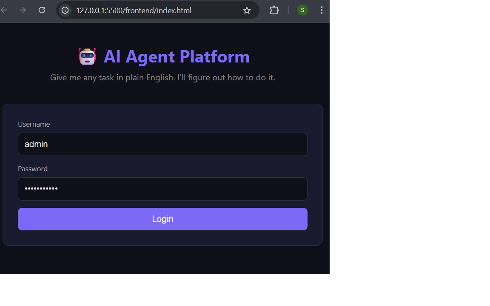
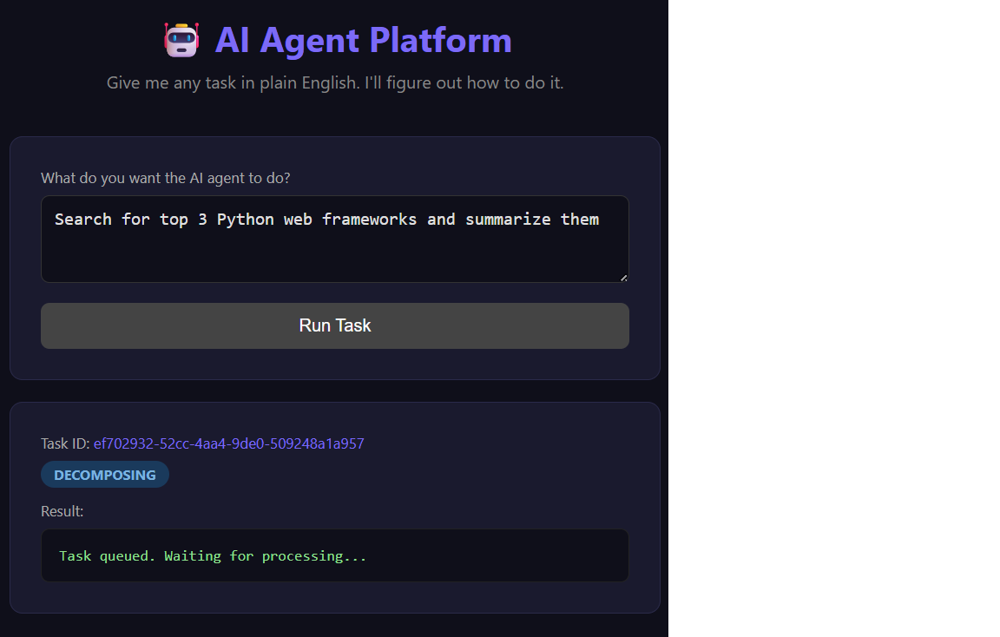
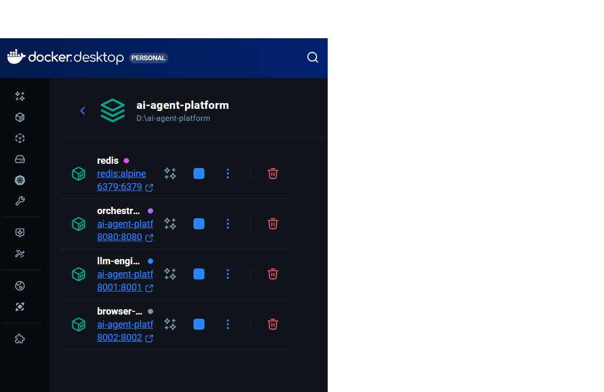

# 🤖 AI Agent Platform

> An autonomous AI agent system that executes multi-step tasks from plain English input — built with microservices architecture.

---

## 📸 Demo

### Login & Submit Task


### Task Processing


### Results


---

## 🏗️ Architecture

```
User (Frontend)
      │
      ▼
┌─────────────────────┐
│  Spring Boot API    │  ← REST API + JWT Auth (Port 8080)
│   (Orchestrator)    │
└─────────┬───────────┘
          │ Push Task ID
          ▼
┌─────────────────────┐
│       Redis         │  ← Async Task Queue (Port 6379)
│   (Task Queue)      │
└─────────┬───────────┘
          │ Pop Task ID
          ▼
┌─────────────────────┐
│   Python FastAPI    │  ← LLM Engine / OpenAI (Port 8001)
│    (LLM Engine)     │
└─────────┬───────────┘
          │ Push Subtasks
          ▼
┌─────────────────────┐
│ Python + Playwright │  ← Browser Worker (Port 8002)
│  (Browser Worker)   │
└─────────┬───────────┘
          │ Store Results
          ▼
       Redis → Back to User
```

**Flow:**
1. User submits a plain English task via the frontend
2. Spring Boot accepts it, stores in Redis queue
3. LLM Engine picks it up, calls OpenAI to decompose into subtasks
4. Browser Worker executes each subtask autonomously using Playwright
5. Results stored back in Redis and returned to user

---

## 🛠️ Tech Stack

| Layer | Technology |
|-------|-----------|
| API / Orchestrator | Java 21, Spring Boot 3, Spring Security |
| Authentication | JWT (JSON Web Tokens) |
| Message Queue | Redis |
| LLM Engine | Python 3.11, FastAPI, OpenAI GPT-4o-mini |
| Browser Automation | Python, Playwright, Chromium |
| Containerization | Docker, Docker Compose |
| Frontend | HTML, CSS, Vanilla JavaScript |

---

## 🚀 How to Run

### Prerequisites
- Docker Desktop installed and running
- OpenAI API key (get one at https://platform.openai.com/api-keys)

### Steps

**1. Clone the repository**
```bash
git clone https://github.com/sravanthi-shakkara/AI-agent-platform.git
cd AI-agent-platform
```

**2. Add your OpenAI API key**
```bash
# Create .env file
echo OPENAI_API_KEY=your_key_here > .env
```

**3. Start all services**
```bash
docker-compose up --build
```

Wait for all 4 services to start (5-10 minutes first time):
```
✅ redis        - running on port 6379
✅ orchestrator - running on port 8080
✅ llm-engine   - running on port 8001
✅ browser-worker - running on port 8002
```

**4. Open the frontend**

Open `frontend/index.html` in your browser.

**5. Login**
```
Username: admin
Password: password123
```

**6. Submit a task**
```
Example: "Search for top 5 Python web frameworks and summarize them"
```

---

## 📡 API Endpoints

### Auth
```http
POST /api/auth/login
Content-Type: application/json

{
  "username": "admin",
  "password": "password123"
}
```

### Create Task
```http
POST /api/tasks
Authorization: Bearer <token>
Content-Type: application/json

{
  "input": "Search for top AI frameworks in 2024"
}
```

### Get Task Status
```http
GET /api/tasks/{taskId}
Authorization: Bearer <token>
```

### Task Status Flow
```
PENDING → DECOMPOSING → PROCESSING → DONE
```

---

## 📁 Project Structure

```
ai-agent-platform/
├── docker-compose.yml          ← All services defined here
├── .env                        ← API keys (not committed)
├── orchestrator/               ← Spring Boot microservice
│   └── src/main/java/com/aiagent/orchestrator/
│       ├── controller/         ← REST endpoints
│       ├── model/              ← Data models
│       ├── security/           ← JWT auth
│       ├── service/            ← Business logic
│       └── config/             ← Redis + Security config
├── llm-engine/                 ← Python FastAPI microservice
│   ├── main.py                 ← OpenAI integration + queue processor
│   ├── requirements.txt
│   └── Dockerfile
├── browser-worker/             ← Python Playwright microservice
│   ├── main.py                 ← Browser automation
│   ├── requirements.txt
│   └── Dockerfile
└── frontend/
    └── index.html              ← Simple web UI
```

---

## 🔑 Key Engineering Concepts Demonstrated

- **Microservices Architecture** — 3 independent services communicating via Redis queues
- **Async Processing** — Non-blocking task execution using Redis as message broker
- **JWT Authentication** — Stateless auth across all API endpoints
- **Container Orchestration** — Docker Compose with service dependencies and networking
- **LLM Integration** — OpenAI API for natural language task decomposition
- **Browser Automation** — Playwright for autonomous web interactions

---

## ⚠️ Note

System is fully functional end-to-end. OpenAI API integration requires active API credits to execute live tasks. All microservices, Redis queuing, JWT auth, and Docker containerization are verified working.

---

## 👩‍💻 Author

**Sravanthi Shakkara**  
[GitHub](https://github.com/sravanthi-shakkara)

---

## 📄 License

MIT License
